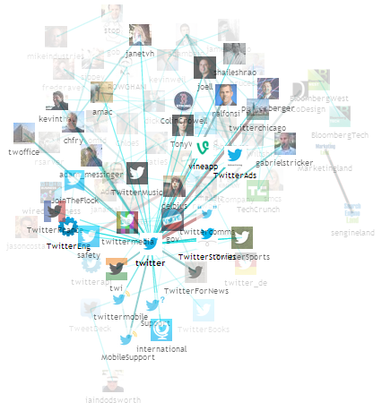

TwitterGraph
============

TwitterGraph is an application that graphs interactions between a Twitter user's 
friends (who they are following), where interactions are defined by incoming or 
outgoing mentions.

The application uses [Twitter4j][1] to fetch the data, [Hadoop][2] 
(with [Scalding][3]) to filter the data, and [VivaGraphJS][4] to display an 
interactive SVG graph of the data. A demo of the frontend interface can be
found [here](http://ee.walfas.org/twittergraph).

##Usage

###Setup

Modify `src/main/scala/twittergraph/TwitterOAuth.scala` to include your Twitter 
OAuth keys, then use sbt to create the jar file and start the jetty server.

	sbt
	assembly
	container:start

If successful, point your browser at `localhost:8080` to see the default graph 
of @[twitter](http://twitter.com/twitter)'s interactions (based on the provided 
`output/twitter.json`).

###Run

To generate a graph for a particular user, point a browser at:

	localhost:8080/get?user=username

and the web interface will initiate the Hadoop job, printing the console output 
to the browser. When the job completes, a JSON file can be found at 
`output/username.json`. 

_Note_: due to the Twitter API limits, the application can only get data for 
180 users every 15 minutes. If the API limit is reached, the job will sleep 
for 15 minutes and retry when more API calls are available. Depending on your 
Hadoop configurations, the job may actually time out and fail, but the data is 
stored in HBase so you can just re-run the job later (possibly several times).

After the JSON file has been created, view the user's graph at:

	localhost:8080/?user=username

Options are available to change opacity, filter by mentions, etc.

##Details

Pseudocode, given a user named `user` and a default cache period of 3 days:

1. If user has not been updated in the last 3 days, get info (usernames, icons) 
	about user and all of user's friends. Store data in HBase.
2. Get the latest 200 tweets from each friend that has not been updated in 3 days
	* Count the number of times they have mentioned any user
	* Store mentions counts for that friend in HBase
	* If friend has been updated in the last 3 days, return the mentions counts
3. For each friend, filter out any mentions that aren't directed at one of 
	user's other friends
4. Create a directed graph of mentions, where nodes are users, edges are 
	interactions between users, and the weight of each edge is the number of 
	mentions

<!--Footnotes-->
[1]: http://twitter4j.org/en
[2]: http://hadoop.apache.org/
[3]: https://github.com/twitter/scalding
[4]: https://github.com/anvaka/VivaGraphJS

